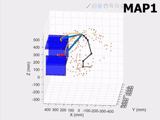
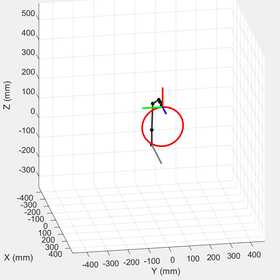

# MEAM 520 Labs
## Lab1: Forward Kinematics
Calculate end-effector pose from joint parameters

## Lab2: Inverse Kinematics
Calculate joint parameters from end-effector pose

## Lab3: PRM Planner
Path planning in cluttered environment with Probabilistic Roadmap Method and Dijkstra graph search.

## Lab4: Velocity Kinematics
Motion planning with velocity kinematics.

## Lab5: Potential Field Planner
Path planning with potential field planner.

## Final Project: Vision-based Pick and Place
