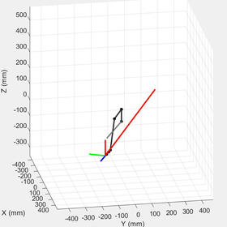
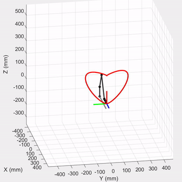

# MEAM 520 Labs
## Lab1: Forward Kinematics
Calculate end-effector pose from joint parameters
## Lab2: Inverse Kinematics
Calculate joint parameters from end-effector pose
## Lab3: Trajectory Planning
Trajectory planning in cluttered environment with Probabilistic Roadmap Method and Dijkstra search.

## Lab4: Velocity Kinematics
  
<!--  -->